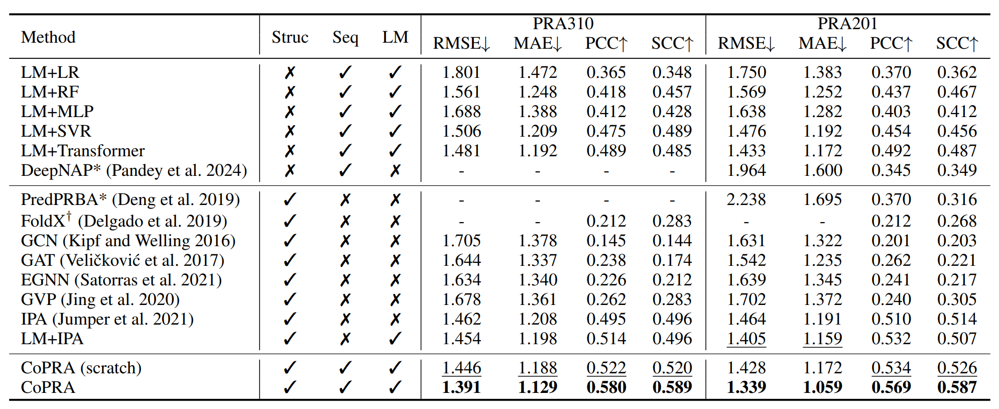

# 🥥 CoPRA

<p align="left">
  <a href="https://pytorch.org/">
    
  </a>
  <a href="https://lightning.ai/">
    
  </a>
  <a href="https://arxiv.org/abs/2409.03773">
    
  </a>
  <a href="https://mamba.readthedocs.io/en/latest/">
    
  </a>
  <a href="https://huggingface.co/">
    
  </a>
</p>
This is the official implementation of CoPRA: Bridging Cross-domain Pretrained Sequence Models with Complex Structures for Protein-RNA Binding Affinity Prediction (AAAI 2025)


CoPRA is a state-of-the-art predictor of protein-RNA binding affinity. The framework of CoPRA is based on a protein language model and an RNA-language model, with complex structure as input. The model was pre-trained on the PRI30k dataset via a bi-scope stratyge and fine-tuned on PRA310. CoPRA can also be redirected to predict mutation effects, showing its strong per-structure prediction performance on mCSM_RNA dataset. Please see more details in [our paper](https://arxiv.org/abs/2409.03773).

Please do not hesitate to contact us or create an issue/PR if you have any questions or suggestions!

## 🛠️ Installation

**Step 1**. Clone this repository and setup the environment.
```
git@github.com:hanrthu/CoPRA.git
cd CoPRA
mamba env create -f environment.yml
```

**Step 2**. Install flash-attn and rinalmo with the following command, you may also need to download Rinalmo-650M model and place it at weights/ folder of this repo.
```
# Download flash-attn-2.6.3 wheel file at https://github.com/Dao-AILab/flash-attention/releases/download/v2.6.3/flash_attn-2.6.3+cu118torch2.1cxx11abiFALSE-cp310-cp310-linux_x86_64.whl
pip install flash_attn-2.6.3+cu118torch2.1cxx11abiFALSE-cp310-cp310-linux_x86_64.whl
git clone git@github.com:lbcb-sci/RiNALMo.git
cd RiNALMo
pip install -e .
```
## 📖 Datasets and weights for PRA
Here, we provide our proposed datasets, including PRA310, PRA201 and PRI30k together with an mCSM_RNA dataset, you can easily access them through 🤗Huggingface: [/Jesse7/CoPRA_data](https://huggingface.co/datasets/Jesse7/CoPRA_data/tree/main). The only difference between PRA201 and PRA310 are the selected samples, thus the PRA201 labels and splits are in PRA310/splits/PRA201.csv. Download these datasets at datasets/ folder.

The number of samples of the original dataset is shown below, we take PRA as the abbreviation of Protein-RNA binding affinity:

| Dataset | Type | Size |
| :---: | :---: | :---: |
| PRA310 | PRA | 310 |
| PRA201 | PRA (pair-only) | 201 |
| PRI30k | Unsupervised complexes | 30006 |
| mCSM-RNA | Mutation effect on PRA | 79 |


We also provide a five-fold model checkpoints after pretraining Co-Former with PRI30k and finetune it with PRA310, and they can also be downloaded through 🤗Huggingface: [/Jesse7/CoPRA](https://huggingface.co/Jesse7/CoPRA). This repository also contains a pretrained RiNALMo-650M weights. Download these weights at weights/ folder.

The performance of 5-fold cross validation on PRA310 reaches state-of-the-art, and here is the comparison:




## 🚀 Training on the protein-RNA datasets

**Note:** It is normal that the first epoch for training on a new dataset is relatively slow, because we need to conduct the caching procedure.

### Run finetune on PRA310
```
python run.py finetune --model_config ./config/models/copra.yml --data_config ./config/datasets/PRA310.yml --run_config ./config/runs/finetune_struct.yml
```

### Run finetune on PRA201
```
python run.py finetune --model_config ./config/models/copra.yml --data_config ./config/datasets/PRA201.yml --run_config ./config/runs/finetune_struct.yml
```

### Run Bi-scope Pre-training on PRI30k
```
python run.py finetune pretune --model_config ./config/models/copra.yml --data_config ./config/datasets/biolip.yml --run_config ./config/runs/pretune_struct.yml
```
After pretraining, you can continue to finetune on a new dataset with the finetuning scripts and the specification of ckpt for the pretrained model in config/runs/finetune_struct.yml

## 🚀 Zero-shot Blind-test on the protein-RNA mutation effect datasets

```
python run.py test --model_config ./config/models/copra.yml --data_config ./config/datasets/blindtest.yml --run_config ./config/runs/zero_shot_blindtest.yml
```

## 🖌️ Citation
If you find our repo useful, please kindly consider citing:
```
@article{han2024copra,
  title={CoPRA: Bridging Cross-domain Pretrained Sequence Models with Complex Structures for Protein-RNA Binding Affinity Prediction},
  author={Han, Rong and Liu, Xiaohong and Pan, Tong and Xu, Jing and Wang, Xiaoyu and Lan, Wuyang and Li, Zhenyu and Wang, Zixuan and Song, Jiangning and Wang, Guangyu and others},
  journal={arXiv preprint arXiv:2409.03773},
  year={2024}
}
```